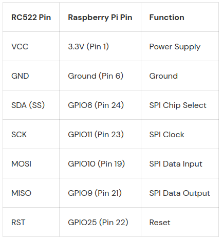

# ETicketTotem

### RFID reader python utility

#### Setup

Create the virtual environment in your raspberry pi:

`python3 -m venv venv`

`source venv/bin/activate`

Install the dependencies:

`pip install -r requirements.txt`

Connect the RFID reader pins to the corresponding ones:

Start the reader utility with:

`python3 read_rfid.py`

If needed you can start systemd daemon, first replace the paths inside the service file with the correct ones if needed and then run:

`sudo cp service/rfid.service /etc/systemd/system/rfid.service`

`sudo systemctl daemon-reload`

`sudo systemctl enable rfid.service`

`sudo systemctl start rfid.service`

Check the service status with:

`sudo systemctl status rfid.service`

### Frontend

#### Developement

It is not recommended to develop the frontend directly in the raspberry due to its limited computing capabilities and storage. In case you choose to do it you have to install the full flutter sdk to build the application and run it with:

`cd totem_frontend`

`flutter run`

A good option could be connecting your PC and the raspberry to the same LAN and serve the webpage with your PC using a python server.

Clone this repo also on your PC (with flutter SDK installed), build the project and start the webserver in the `<port>` you want:

`cd totem_frontend`

`flutter build web`

`cd build/web`

`python3 -m http.server <port>`

Open the browser inside the Raspberry, navigate to `<PC ip address>:<port>`.

### Kiosk mode utility

#### Setup

Download `unclutter` package

`sudo apt-get install unclutter`

Modify the kiosk utility script:

`nano ~/ETicketTotem/service/kiosk.sh`

with the correct `<PC ip address>:<port>`

Make the kiosk utility executable:

`sudo chmod +x kiosk.sh`

Run the kiosk utility with:

`./kiosk.sh`

If needed you can start systemd daemon, first replace the paths inside the service file with the correct ones if needed and then run:

`sudo cp service/kiosk.service /etc/systemd/system/kiosk.service`

`sudo systemctl daemon-reload`

`sudo systemctl enable kiosk.service`

`sudo systemctl start kiosk.service`

Disable the daemons with:

`sudo systemctl disable <name>.service`

If both daemons are enabled, the Raspberry pi will automatically start in kiosk mode on the flutter page served by the frontend and with the service for the rfid reader running.

The first login on the totem application has to be done with a keyboard (physical or raspbian's virtual keyboard).
If the kiosk mode is already enabled before the first login, it has to be done with a physical keyboard.

TODO: PARLARE DEI FILE .ENV

        SCARICARE TUTTI I VARI FILE DAL RASPBERRY E METTERLI NELLA REPO

### Repo description

TODO: PARLARE DELLA CARTELLA TICKET_FILES

        PARLARE DEL FUNZIONAMENTO GENERALE?
